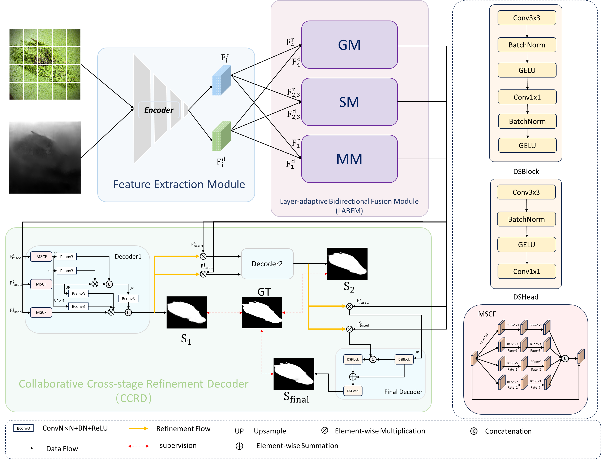
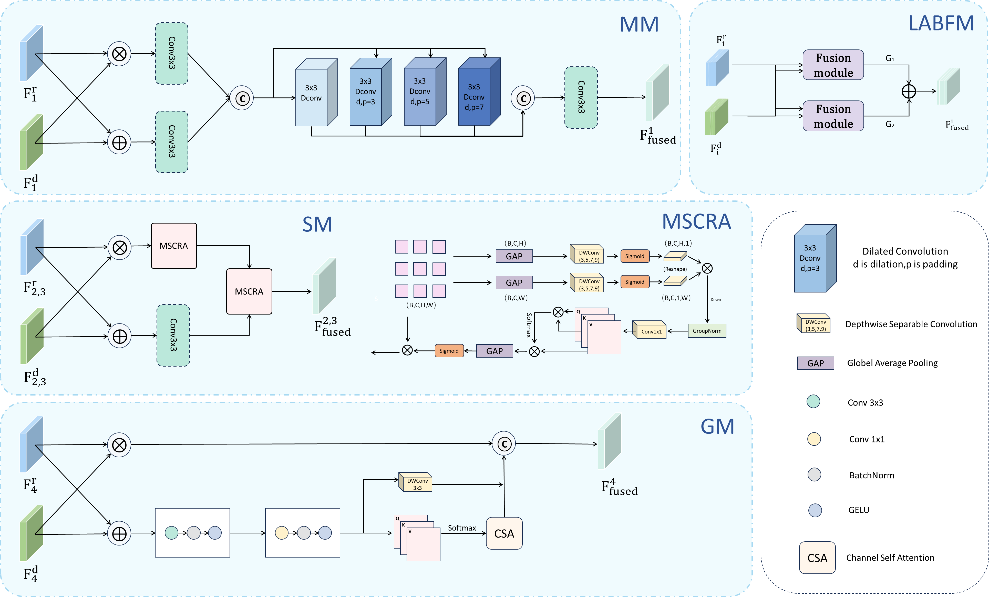
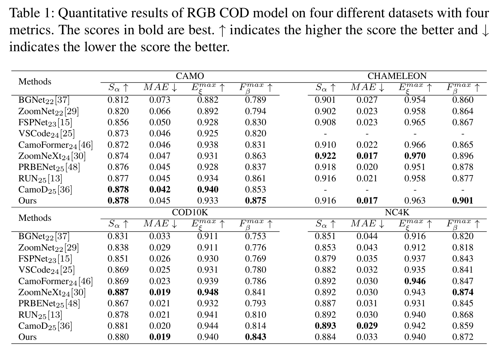
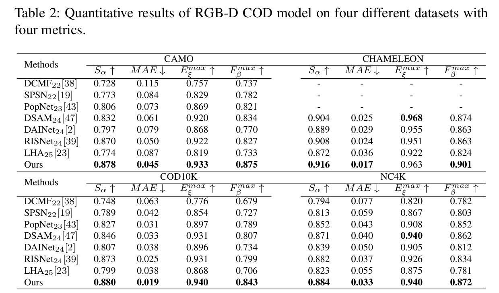
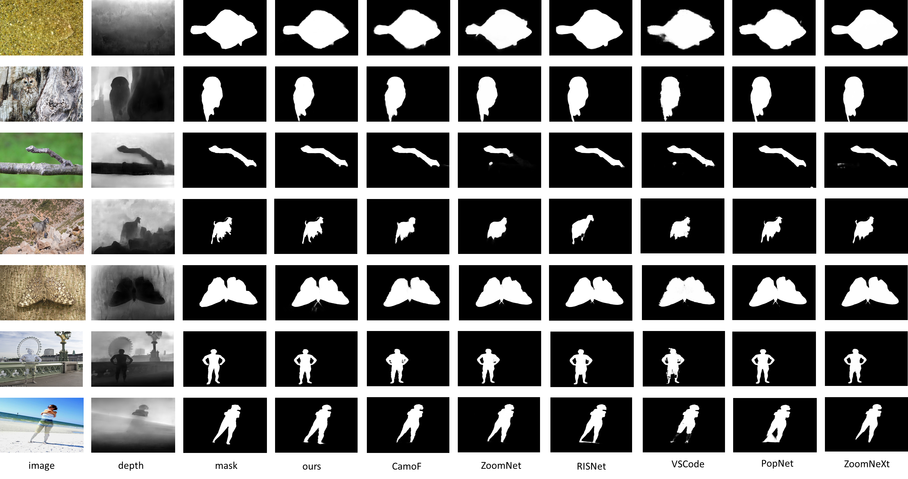

# LaB-Net
This repository is associated with the paper "Hierarchical RGB-D Fusion and Cross-Stage Refinement for Visual Camouflaged Object Detection" submitted to The Visual Computer.

      
 <em> 
    Figure 1: The architecture of LaB-Net.
    </em>

      
 <em> 
    Figure 1: The details of each module of LABFM.
    </em>

## Requirements

Python 3.7, Pytorch 1.5.0+, Cuda 10.2+, TensorboardX 2.1, opencv-python

	  
## Training & Testing
The training and testing experiments are conducted using PyTorch with one NVIDIA 3090 GPU of 24 GB Memory.
Downloading dataset：You can find the [training and test datasets](https://github.com/DengPingFan/SINet/) here.
# Train on COD10K training set (example)
python LaBNet_train.py --dataset COD10K --batch_size 4 --epochs 200 --lr 5e-5 --gpu_id 0

# Test on COD10K test set
python LaBNet_test.py --dataset COD10K --model_path ./checkpoints/labnet_best.pth --save_pred

### Evaluation Script

1.  CODToolbox：（ https://github.com/DengPingFan/CODToolbox ）- By DengPingFan(<https://github.com/DengPingFan>)

2.  Precision_and_recall：（ https://en.wikipedia.org/wiki/Precision_and_recall ）  

##  Results
### Qualitative Comparison

      

      

      

